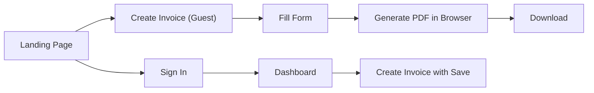
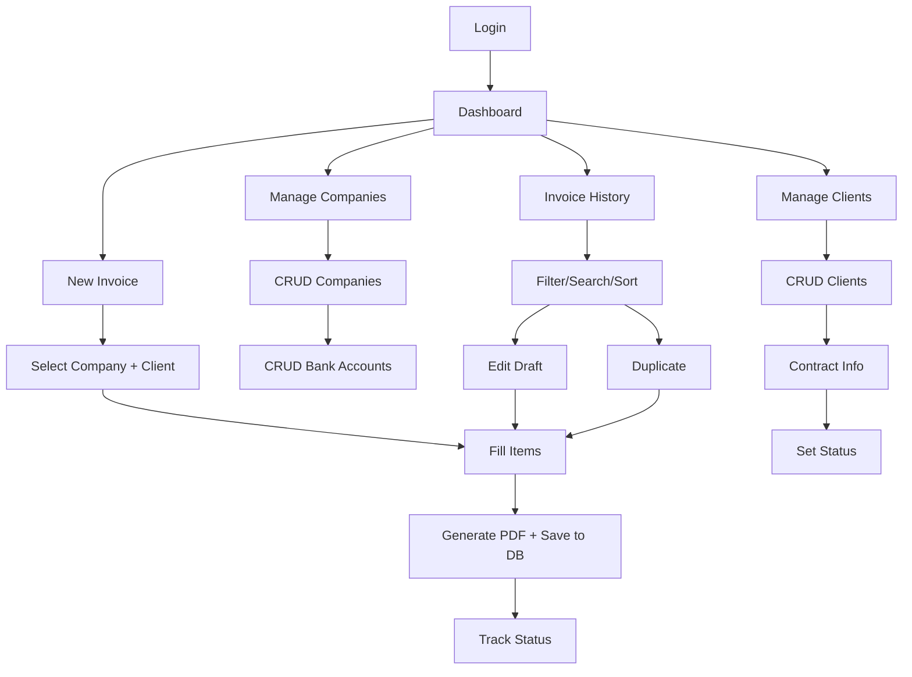
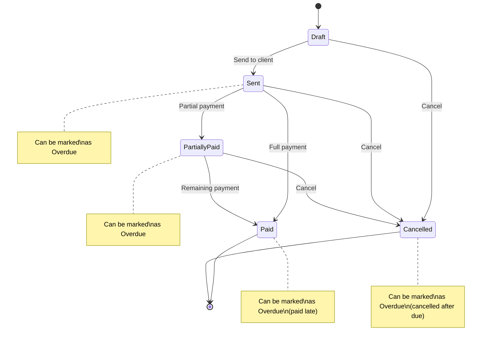

# PRD: Invoice Generator

## 1. Overview

- **Document Owner:** Erik Lindström
- **Initiative Link:** —
- **Main Stakeholder:** Erik Lindström
- **Link to Architecture Documentation:** Invoice Generator SRS
- **Link to Rollout Plan:** TBD
- **Other Related Documents:** Expense Tracker (future integration candidate)
- **Document Version:** 0.4 (Revised — aligned with SRS)

### Change Log

| Version | Date | Changes |
|---------|------|---------|
| 0.3 | — | Initial draft |
| 0.4 | 2026-03-26 | Aligned with SRS: unified architecture (single Vue.js app), resolved frontend tech (Vue.js 3 instead of Flutter Web), aligned status model (5 statuses + isOverdue), currencies (EUR/RSD + custom), company/client entities, shared JWT auth, updated staging model |

---

## 2. Problem Alignment

### 2.1 Background and Objective

Invoice Generator is a universal solution for creating invoices, targeted at freelancers, sole proprietors, and small businesses.

The project fits into the ecosystem of personal financial tools (alongside Expense Tracker) and addresses the lack of a simple, free, and self-hosted tool for generating professional invoices.

**Target Audience:**

- Primary: The author himself (freelancer working with European clients)
- Secondary: Other freelancers and sole proprietors who need a quick way to create an invoice without registration
- Tertiary: Users who need full invoice management with history and analytics

---

### 2.2 Problem Statement and Affected Users

| Problem | Internal/External | User Role | Percentage of Users | Frequency |
|---------|-------------------|-----------|---------------------|-----------|
| No unified invoice template — creating from scratch or searching for old files each time | Internal | Freelancer/Sole Proprietor | 100% (primary user) | 1-2 times per month |
| No centralized invoice storage — difficult to find invoices from six months ago | Internal | Freelancer/Sole Proprietor | 100% | When reporting is needed |
| Payment status not tracked — need to remember manually or maintain a separate list | Internal | Freelancer/Sole Proprietor | 100% | After each invoice |
| Difficult to track currency conversion — invoiced in EUR, received in RSD, exchange rate stored in memory | Internal | Freelancer/Sole Proprietor | ~30% (working with foreign clients) | Upon payment receipt |
| Need a quick invoice without registration — don't want to create an account for a single document | External | Casual user | ~70% of public traffic | One-time |

---

### 2.3 High Level Approach

- For **freelancers and sole proprietors**
- who **issue invoices to clients and want to track payments**
- the solution **Invoice Generator**
- is a **single web application with guest mode (no registration) and authorized mode (dashboard, history, tracking) + future mobile app**
- that **allows creating a professional PDF invoice in under a minute, storing history, and tracking payment statuses**
- unlike **existing solutions (Invoice Ninja, Zoho Invoice, manual templates in Word/Excel)**
- our solution **is free, self-hosted, requires no registration for basic use, and integrates into a personal ecosystem of financial tools**

---

### 2.4 Goals, Values, Metrics and Business Outcome

| Goal (SMART) | Measurable Metrics | Value | Business Outcome | Priority |
|--------------|-------------------|-------|------------------|----------|
| Invoice creation takes less than 2 minutes for a new user | Time to first PDF < 2 min | Time savings, reduced friction | More users complete generation | P0 |
| 100% of author's invoices are created through the system within 3 months of launch | % invoices created via system = 100% | Single storage location, consistent format | Full control over financial documentation | P0 |
| Authorized users see payment status for each invoice | Payment status tracking coverage = 100% | Cash flow transparency | Timely identification of overdue payments | P1 |
| Public form available 99.9% of the time | Uptime via Cloudflare | Reliability for casual users | Reputation, user retention | P1 |
| Mobile app allows invoice creation without computer access | Mobile invoice creation success rate | Flexibility, mobility | Ability to issue invoice "on the go" | P2 |

**Non-goals (explicitly out of scope):**

- Automatic invoice sending via email (user sends PDF manually)
- Integration with accounting systems (1C, QuickBooks, etc.)
- Payment acceptance through the system (tracking status only)
- Multi-currency invoices (one invoice = one currency)

---

### 2.5 Assumptions and Constraints

| Type | Description |
|------|-------------|
| **Assumptions** | Users are willing to enter data manually in exchange for free and self-controlled solution |
| **Assumptions** | PDF is a sufficient format for 99% of cases (Word, Excel not needed) |
| **Assumptions** | Freelancers and sole proprietors rarely have more than 10 line items in a single invoice |
| **Assumptions** | User obtains conversion rate from bank and enters it manually |
| **Constraints** | Single Vue.js application serves both guest and authorized modes |
| **Constraints** | Stage 1 operates without backend — PDF generation in browser only |
| **Constraints** | Authorized part hosted on personal server — limited by its resources |
| **Constraints** | Single developer — prioritization is critical |

---

## 3. Stakeholders' Requirements

### 3.1 Stakeholders and Approvers

| Name & Email | Title | Responsibility Zone | Approval Status | Date of Approval |
|--------------|-------|---------------------|-----------------|------------------|
| **Stakeholders:** | | | | |
| Erik Lindström | Project Owner | All decisions, requirements, priorities | — | — |
| **Development team:** | | | | |
| Erik Lindström | Full-stack Developer | Backend, Frontend, Mobile, Infrastructure | — | — |

---

### 3.2 Requested Business Functions

#### 3.2.1 Landing Page

| ID | Requirement | Priority |
|----|-------------|----------|
| LP-01 | User sees a landing page with a static preview of a sample invoice (image) | P0 |
| LP-02 | User can click "Create Invoice" button to navigate to the invoice form (guest mode, no auth required) | P0 |
| LP-03 | User can click "Sign In" button to authenticate and access the authorized dashboard | P0 |
| LP-04 | Landing page layout: two-column — preview on one side, action buttons on the other | P0 |

#### 3.2.2 Invoice Form (Shared — Guest & Authorized)

| ID | Requirement | Priority |
|----|-------------|----------|
| PF-01 | User can fill in seller information (company name, contact person, address, phone, VAT, Reg No) | P0 |
| PF-02 | User can fill in buyer information (company name, contact person, email, address, VAT, Reg No) | P0 |
| PF-03 | User can add line items (description, quantity, currency, unit price) with auto-calculated totals | P0 |
| PF-04 | User can add up to 10 line items per invoice | P0 |
| PF-05 | User can fill in payment details (bank name, bank address, IBAN, SWIFT) | P0 |
| PF-06 | User can set invoice number, issue date, and due date | P0 |
| PF-07 | User can select currency from predefined list (EUR, RSD) or enter custom currency code | P0 |
| PF-08 | User can set VAT rate (default 0%) with auto-calculated VAT amount | P0 |
| PF-09 | User can add contract/agreement reference | P0 |
| PF-10 | User can add external reference number | P1 |
| PF-11 | System validates format-specific fields (IBAN, SWIFT, email) | P1 |
| PF-12 | System shows confirmation prompt before PDF generation | P1 |
| PF-13 | User can generate and download PDF invoice | P0 |

**Guest mode behavior:** Form operates entirely in browser. PDF generated client-side. No data is saved.

**Authorized mode behavior:** Same form, but after generation the invoice and all its data are saved to the database. User can later view, edit, and track invoice status from the dashboard.

#### 3.2.3 Authorized Web App — Authentication

| ID | Requirement | Priority |
|----|-------------|----------|
| AU-01 | User can log in using credentials from Expense Tracker (shared JWT authentication) | P0 |
| AU-02 | User can log out | P0 |
| AU-03 | Invoice Generator does not have its own registration — users register via Expense Tracker | P0 |

#### 3.2.4 Authorized Web App — Dashboard

| ID | Requirement | Priority |
|----|-------------|----------|
| DA-01 | User sees list of recent invoices with status indicators | P0 |
| DA-02 | User can change invoice status directly from dashboard | P0 |
| DA-03 | User can create new invoice via quick action | P0 |
| DA-04 | User can access company management | P0 |
| DA-05 | User can access client management | P0 |
| DA-06 | Dashboard displays simple, non-cluttered interface | P0 |

#### 3.2.5 Authorized Web App — Company Management

| ID | Requirement | Priority |
|----|-------------|----------|
| CO-01 | User can create a new company profile | P0 |
| CO-02 | User can view list of own companies | P0 |
| CO-03 | User can edit company details (name, contact person, address, phone, VAT, Reg No) | P0 |
| CO-04 | User can delete a company (with confirmation) | P1 |
| CO-05 | User can add multiple bank accounts per company | P0 |
| CO-06 | User can edit/delete bank accounts | P0 |
| CO-07 | User can set custom invoice number prefix per company | P1 |

#### 3.2.6 Authorized Web App — Client Management

| ID | Requirement | Priority |
|----|-------------|----------|
| CL-01 | User can create a new client | P0 |
| CL-02 | User can view list of clients | P0 |
| CL-03 | User can edit client details (company name, contact person, email, address, VAT, Reg No) | P0 |
| CL-04 | User can delete a client (with confirmation) | P1 |
| CL-05 | User can add contract information to client (contract reference, notes) | P0 |
| CL-06 | User can set client status (Active/Inactive) | P0 |
| CL-07 | System prevents creating invoices for inactive clients | P0 |

#### 3.2.7 Authorized Web App — Invoice Management

| ID | Requirement | Priority |
|----|-------------|----------|
| IN-01 | User can create new invoice by selecting company, client, and bank account | P0 |
| IN-02 | User can set issue date and due date | P0 |
| IN-03 | User can add contract/agreement reference to invoice | P0 |
| IN-04 | User can add external reference number to invoice | P1 |
| IN-05 | System auto-generates invoice number (INV-DDMMYYYY-SEQ); custom prefix per company in roadmap | P0 |
| IN-06 | System ensures invoice number uniqueness per company | P0 |
| IN-07 | User can add up to 10 line items per invoice | P0 |
| IN-08 | User can set invoice status (Draft, Sent, Partially Paid, Paid, Cancelled) | P0 |
| IN-09 | User can mark invoice as overdue (isOverdue flag) | P0 |
| IN-10 | User can view invoice history with filters (by status, date range, client) | P0 |
| IN-11 | User can search invoices by client name or invoice number | P1 |
| IN-12 | User can sort invoices (by date, amount, status) | P1 |
| IN-13 | User can download invoice as PDF | P0 |
| IN-14 | User can edit draft invoices | P0 |
| IN-15 | User can duplicate existing invoice | P2 |

**Currency Conversion (Optional Feature):**

| ID | Requirement | Priority |
|----|-------------|----------|
| CV-01 | User can enable/disable conversion tracking per invoice | P1 |
| CV-02 | User can select target currency (excluding invoice currency) | P1 |
| CV-03 | User can enter exchange rate | P1 |
| CV-04 | System calculates received amount (invoice total × exchange rate) | P1 |

**Mobile-Specific:**

| ID | Requirement | Priority |
|----|-------------|----------|
| MO-01 | User can create invoices on mobile | P0 |
| MO-02 | User can view invoice history on mobile | P0 |
| MO-03 | User can change invoice status on mobile | P0 |
| MO-04 | User can manage clients on mobile (create, edit status) | P1 |
| MO-05 | User cannot edit company/bank account settings on mobile (read-only) | P0 |

---

### 3.3 Solution Alignment

#### 3.3.1 Solution Ideas

**Chosen approach:** Single Vue.js application with guest mode (no backend) and authorized mode (Go backend + PostgreSQL) + future mobile app.

| Aspect | Pros | Cons |
|--------|------|------|
| Single Vue.js app for both modes | One codebase, shared form component, consistent UX, familiar tech (same as Expense Tracker) | Heavier bundle for guest mode than pure Vanilla JS |
| Guest mode (no auth) | Instant value — create PDF without registration | No data persistence |
| Authorized mode (shared JWT) | Leverages existing Expense Tracker auth, no separate registration | Dependency on Expense Tracker for user management |
| Go backend | Familiar technology, good performance, single binary deployment | — |
| Self-hosted | Full control, no recurring costs, data privacy | Maintenance responsibility, uptime depends on personal server |

#### 3.3.2 Product Flow

**Landing Page Flow:**

**Authorized User Flow:**

#### 3.3.3 System Consumers and Contributors

| System/Project | Relationship | Notes |
|----------------|--------------|-------|
| Expense Tracker | Shared authentication (JWT) | Shared SECRET_KEY, user_id and family_id context |
| Currency Converter | Potential microservice | Could be extracted as shared service for both projects |

#### 3.3.4 Business Risks

| Risk | Severity | Mitigation Plan | Status | Owner |
|------|----------|-----------------|--------|-------|
| Scope creep — project grows beyond manageable size | MEDIUM | Strict MVP adherence, new ideas go to backlog, regular scope reviews | CONFIRMED | Erik Lindström |
| Time constraints — balancing main job, YouTube channel, and this project | MEDIUM | Realistic timelines, iterative delivery, MVP-first approach | CONFIRMED | Erik Lindström |
| PDF rendering inconsistency — different browsers render PDFs differently | LOW | Test on major browsers, use well-supported libraries | TO CONFIRM | Erik Lindström |
| Data loss on self-hosted server | LOW | Regular database backups, documented recovery procedure | TO CONFIRM | Erik Lindström |

---

## 4. Rollout Readiness

### 4.1 Stages

#### 4.1.1 Stage 1: Invoice Form (Guest Mode)

**Scope:** Vue.js application with landing page, invoice form, and browser-based PDF generation. No backend required.

**Target:** Functional tool for personal use + public availability.

| ID | Feature | Description | Priority |
|----|---------|-------------|----------|
| S1-01 | Vue.js project setup | Project structure, routing, state management (Pinia), Tailwind CSS | P0 |
| S1-02 | Landing page | Two-column layout: static invoice preview (image) + two action buttons | P0 |
| S1-03 | Invoice form | All fields: seller, buyer, items, payment details, contract/external reference | P0 |
| S1-04 | Seller fields | Company name, contact person, address, phone, VAT, Reg No | P0 |
| S1-05 | Buyer fields | Company name, contact person, email, address, VAT, Reg No | P0 |
| S1-06 | Line items management | Add/remove items, auto-calculate totals (up to 10 items) | P0 |
| S1-07 | Currency selection | Dropdown with EUR, RSD + custom input option | P0 |
| S1-08 | VAT calculation | Editable VAT rate input (default 0%) with auto-calculated amount | P0 |
| S1-09 | Contract/external reference | Contract reference + external reference fields | P0 |
| S1-10 | PDF generation | Browser-based generation (client-side) | P0 |
| S1-11 | PDF download | Download generated invoice | P0 |
| S1-12 | Format validation | IBAN, SWIFT, email validation | P1 |
| S1-13 | Confirmation prompt | "Have you verified the document?" before generation | P1 |
| S1-14 | Responsive design | Mobile-friendly form layout | P1 |
| S1-15 | "Sign In" button | Present on landing page, leads to auth (disabled/placeholder until Stage 2) | P0 |
| S1-16 | Deployment | Deploy to self-hosted server via Cloudflare Tunnel (invoice.digitlock.systems) | P0 |

**Estimated effort:** 2-3 weeks

---

#### 4.1.2 Stage 2: Backend + Authentication

**Scope:** Go backend with shared JWT authentication, database schema, CRUD APIs for companies, clients, bank accounts, and invoices.

| ID | Feature | Description | Priority |
|----|---------|-------------|----------|
| S2-01 | API scaffold | REST API structure (Go, Chi router), routing, middleware | P0 |
| S2-02 | Database setup | Database schema, migrations (companies, clients, bank_accounts, invoices, invoice_items) | P0 |
| S2-03 | Shared JWT authentication | JWT validation using shared SECRET_KEY with Expense Tracker | P0 |
| S2-04 | Company CRUD API | Create, read, update, delete companies | P0 |
| S2-05 | Bank account CRUD API | Manage bank accounts per company | P0 |
| S2-06 | Client CRUD API | Manage clients with status and contract info | P0 |
| S2-07 | Invoice CRUD API | Manage invoices with all fields, status transitions | P0 |
| S2-08 | Server-side PDF generation | PDF generation on backend | P0 |
| S2-09 | Invoice number auto-generation | INV-DDMMYYYY-SEQ per user, unique per company | P0 |

**Estimated effort:** 3-4 weeks

---

#### 4.1.3 Stage 3: Web Dashboard

**Scope:** Authorized user interface integrated into the same Vue.js app — dashboard, company/client management, invoice history.

| ID | Feature | Description | Priority |
|----|---------|-------------|----------|
| S3-01 | Auth integration in frontend | Login screen, JWT handling, route guards | P0 |
| S3-02 | Dashboard screen | Recent invoices, quick actions, status indicators | P0 |
| S3-03 | Company management screens | List, create, edit companies and bank accounts | P0 |
| S3-04 | Client management screens | List, create, edit clients with status and contract info | P0 |
| S3-05 | Invoice creation flow (auth) | Form reuses guest component, but saves to DB via API | P0 |
| S3-06 | Invoice auto-numbering UI | Display auto-generated number, allow editing | P0 |
| S3-07 | Invoice history screen | List with filters, search, sorting | P0 |
| S3-08 | Status management | Change status (5 statuses), mark as overdue (isOverdue flag) | P0 |
| S3-09 | PDF download from history | Download invoices from history | P0 |
| S3-10 | Currency conversion tracking | Optional conversion fields per invoice | P1 |

**Estimated effort:** 4-6 weeks

---

#### 4.1.4 Stage 4: Mobile App

**Scope:** Flutter mobile app for iOS and Android.

| ID | Feature | Description | Priority |
|----|---------|-------------|----------|
| S4-01 | Mobile project setup | Flutter project, shared design system | P0 |
| S4-02 | Mobile authentication | Login/logout via shared JWT (no registration on mobile) | P0 |
| S4-03 | Mobile dashboard | Recent invoices, quick actions | P0 |
| S4-04 | Mobile invoice creation | Create invoices on the go | P0 |
| S4-05 | Mobile invoice history | View and filter invoices | P0 |
| S4-06 | Mobile status management | Change status, mark overdue | P0 |
| S4-07 | Mobile client management | View clients, create new, change status | P1 |
| S4-08 | Read-only company view | View company/bank details (no editing) | P0 |
| S4-09 | iOS build and TestFlight | Build for iOS, test via TestFlight | P0 |
| S4-10 | Android build and testing | Build APK, test on device | P0 |

**Estimated effort:** 3-4 weeks

---

#### 4.1.5 Out of MVP (Future Roadmap)

| Feature | Description | Stage |
|---------|-------------|-------|
| Multi-language support | EN, RU, SR interface localization | Future |
| Company logo upload | Upload and display logo on invoices | Future |
| Email sending | Send invoices directly via email | Future |
| Recurring invoices | Auto-generate invoices on schedule | Future |
| Invoice templates | Multiple PDF templates/styles | Future |
| Analytics dashboard | Revenue charts, client statistics | Future |
| Expense Tracker integration | Link invoices to expenses, shared auth already in place | Future |
| Currency converter microservice | Shared service with auto-rates | Future |
| Export to Excel/CSV | Export invoice history | Future |
| App Store / Google Play release | Public release of mobile app | Future |
| Custom invoice number prefix | Per-company prefix (currently INV-DDMMYYYY-SEQ) | Future |

---

### 4.2 Deliverables

| Stage | Deliverable | Format |
|-------|-------------|--------|
| Stage 1 | Landing page + invoice form (guest mode) | Vue.js app (self-hosted via Cloudflare Tunnel) |
| Stage 1 | User documentation | README.md |
| Stage 2 | Backend API | Docker container (Go binary) |
| Stage 2 | Database schema | SQL migrations |
| Stage 2 | API documentation | OpenAPI/Swagger |
| Stage 3 | Web dashboard (authorized mode) | Same Vue.js app |
| Stage 4 | iOS app | IPA (TestFlight) |
| Stage 4 | Android app | APK |

---

## 5. Open Issues

| # | Issue | Contact Point | Decision | Status |
|---|-------|---------------|----------|--------|
| 1 | How to handle invoice number sequence for guest form? (no server = no persistence) | Erik Lindström | Manual input with format suggestion; uniqueness is user's responsibility in guest mode | Decided |
| 2 | VAT calculation complexity — different rates per country/client? | Erik Lindström | MVP: single editable rate per invoice (default 0%); advanced VAT logic in roadmap | Decided |
| 3 | Domain SSL certificates management | Erik Lindström | Cloudflare Tunnel for all traffic | Decided |
| 4 | Mobile app distribution — TestFlight only or public App Store release? | Erik Lindström | TestFlight/APK for personal use; public release in Future Roadmap | Decided |
| 5 | Should inactive clients be hidden or just disabled for invoice creation? | Erik Lindström | TBD — decide during Stage 3 UX design | Open |
| 6 | Invoice PDF template customization — how flexible should it be? | Erik Lindström | MVP: fixed template based on sample; customization in Future Roadmap | Decided |
| 7 | Client-side PDF library choice for Stage 1 (guest mode) | Erik Lindström | TBD — evaluate jsPDF, pdf-lib, or similar | Open |

---

## Appendix A: Technical Overview

For detailed technical specifications, see **Invoice Generator SRS**.

| Aspect | Decision |
|--------|----------|
| Backend | Go microservice (Chi router, sqlc, pgx/v5) |
| Frontend | Vue.js 3, TypeScript, Pinia, Tailwind CSS |
| Mobile | Flutter (iOS + Android) |
| Database | PostgreSQL |
| Authentication | Shared JWT with Expense Tracker |
| Hosting | Self-hosted via Cloudflare Tunnel (invoice.digitlock.systems) |

---

## Appendix B: Invoice Template Reference

Based on samples: `INV-03022026`, `INV-2025-2` (Deel), `30062025/1216` (Dream Finance)

### Invoice Structure

```mermaid
flowchart TB
    subgraph HEADER["1. Header"]
        H1["Invoice number"]
        H2["Issue date"]
        H3["Due date"]
        H4["Contract/Agreement reference"]
        H5["External reference"]
    end

    subgraph SELLER["2. Seller (From)"]
        S1["Company name"]
        S2["Contact person"]
        S3["Address"]
        S4["Phone"]
        S5["VAT number"]
        S6["Registration number"]
    end

    subgraph BUYER["3. Buyer (Bill to)"]
        B1["Company name"]
        B2["Contact person"]
        B3["Email"]
        B4["Address"]
        B5["VAT number"]
        B6["Registration number"]
    end

    subgraph ITEMS["4. Line Items Table"]
        I1["Description"]
        I2["Quantity"]
        I3["Currency"]
        I4["Unit Price"]
        I5["Total"]
    end

    subgraph TOTALS["5. Totals"]
        T1["Subtotal"]
        T2["VAT rate + amount"]
        T3["Total"]
    end

    subgraph PAYMENT["6. Payment Details"]
        P1["Bank name"]
        P2["Bank address"]
        P3["IBAN"]
        P4["SWIFT"]
    end

    HEADER --> SELLER --> BUYER --> ITEMS --> TOTALS --> PAYMENT
```

### Field Summary

| Section | Required Fields | Optional Fields |
|---------|-----------------|-----------------|
| Header | Invoice number, Issue date, Due date | Contract reference, External reference |
| Seller | Company name, Contact person, Address, VAT, Reg No | Phone |
| Buyer | Company name, Address | Contact person, Email, VAT, Reg No |
| Items | Description, Quantity, Currency, Unit Price | — |
| Totals | Subtotal, VAT rate, Total | — |
| Payment | Bank name, IBAN, SWIFT | Bank address |

---

## Appendix C: Status Model

### Invoice Status Flow

### Invoice Statuses

| Status | Description |
|--------|-------------|
| Draft | Draft, not sent to client |
| Sent | Sent to client, awaiting payment |
| Partially Paid | Partially paid |
| Paid | Fully paid |
| Cancelled | Cancelled |

### Overdue Flag

`isOverdue: boolean` — applicable to statuses: Sent, Partially Paid, Paid, Cancelled

Allows tracking client reliability independently of current status.