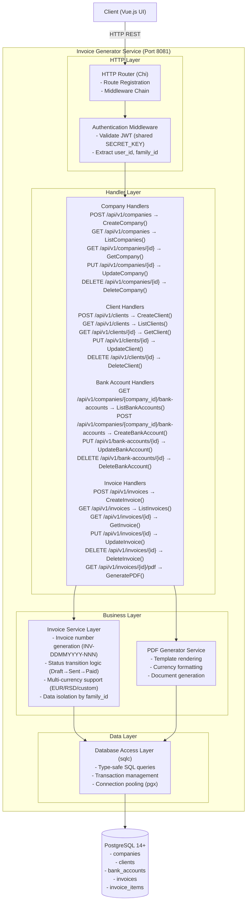
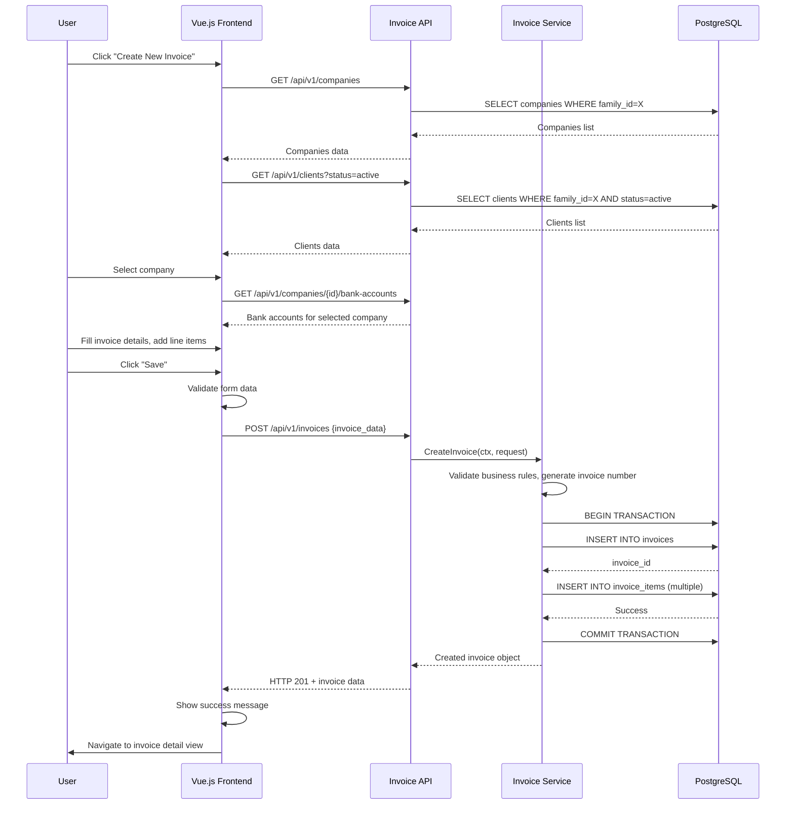
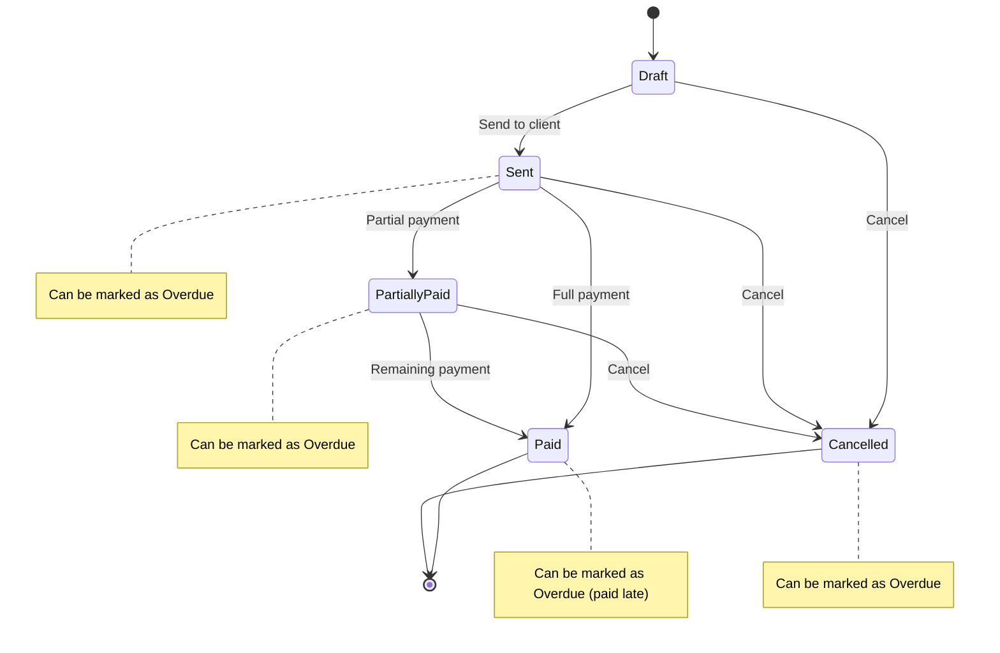

# Invoice Generator - System Requirements Specification

---

# 1. Introduction

This System Requirements Specification (SRS) document provides detailed technical requirements for **v0.1.0 (MVP)** of the Invoice Generator — a standalone microservice for creating, managing, and generating professional PDF invoices with multi-currency support.

**Document Version:** 0.2 (Revised — aligned with PRD v0.4)

### Change Log

| Version | Date | Changes |
|---------|------|---------|
| 0.1 | — | Initial draft |
| 0.2 | 2026-03-26 | Aligned with PRD v0.4: added companies/clients entities, 5 invoice statuses + isOverdue, editable VAT, custom currency input, contact_person/phone/contract_reference/external_reference fields, bank accounts linked to company, line items max 10, updated status transitions and data model |

**Document Purpose**

This document serves as the primary technical specification for MVP implementation, defining the REST API contract, data model, PDF generation behavior, authentication integration, and non-functional constraints for core invoice management functionality.

**Scope**

The SRS covers the v0.1.0 MVP implementation with focus on essential functionality:

- **Core Functionality**: CRUD operations for companies, clients, bank accounts, and invoices; PDF generation with single template; invoice lifecycle management (Draft/Sent/Partially Paid/Paid/Cancelled + isOverdue flag)
- **Technical Architecture**: Standalone Go microservice with REST API (port 8081) and dedicated PostgreSQL database
- **Multi-Currency Support**: EUR and RSD as predefined currencies with custom currency code input; manual exchange rate entry (external API integration post-MVP)
- **Authentication**: JWT-based with shared SECRET_KEY from Expense Tracker (user_id and family_id context)
- **Invoice Number Format**: Auto-generated per user — `INV-DDMMYYYY-NNN` (editable); custom prefix per company in roadmap
- **Out of Scope for MVP**: Email delivery (v0.2.0+), recurring invoices (v1.0+), custom templates (v1.0+), payment webhooks (v2.0+)

**Target Audience**

- Software developer implementing the MVP
- Business stakeholder (Igor Kudinov) for requirement validation
- QA engineer for testing specification
- Portfolio reviewers for system analysis demonstration

**Related Documents**

- **PRD: Invoice Generator v0.4** — Product Requirements Document
- **Expense Tracker SRS** — Reference architecture for authentication patterns
- **SRS Unified Template** — Structure guidelines

**Technology Stack**

- **Backend**: Go 1.21+ with Chi router
- **Database**: PostgreSQL 14+, sqlc (type-safe SQL), pgx/v5 driver
- **Authentication**: golang-jwt library (shared SECRET_KEY with Expense Tracker)
- **Frontend**: Vue.js 3, TypeScript, Pinia, Tailwind CSS
- **PDF Generation**: gofpdf or similar stable Go library (server-side); jsPDF or pdf-lib (client-side for guest mode)
- **API Documentation**: Swagger/OpenAPI 3.0
- **Deployment**: Docker container, self-hosted via Cloudflare Tunnel

---

# 2. Functional Requirements

## 2.1 SRS for API

### 2.1.1 Invoice Management Service

**Components Diagram**



### 2.1.2 POST /api/v1/invoices

##### Description

Creates a new invoice with line items and returns the created invoice object with auto-generated unique invoice number in format `INV-DDMMYYYY-NNN` where NNN is a sequential counter per user for the given date. Invoice is initially created in `draft` status.

##### Endpoint

```
POST http://localhost:8081/api/v1/invoices
```

**Headers:**
- `Authorization: Bearer <JWT_TOKEN>` (required)
- `Content-Type: application/json` (required)

##### Authorization

JWT Bearer Token obtained from Expense Tracker with claims:
- `user_id` — Unique user identifier
- `family_id` — Family context for data isolation
- `exp` — Token expiration

Token validated using shared `SECRET_KEY` environment variable.

##### Request parameters

###### Request example

```json
{
  "company_id": 1,
  "client_id": 3,
  "bank_account_id": 5,
  "issue_date": "2026-02-08",
  "due_date": "2026-03-08",
  "currency": "EUR",
  "vat_rate": "0.00",
  "contract_reference": "Service Agreement dated 26.01.2026",
  "external_reference": "PO-2026-0042",
  "notes": "Payment due within 30 days.",
  "items": [
    {
      "description": "Sign-on bonus per Service Agreement dated 26.01.2026",
      "quantity": 1,
      "unit_price": "2050.98"
    }
  ]
}
```

| Parameter | Type | Required | Description | Example |
|-----------|------|----------|-------------|---------|
| company_id | integer | Yes | Company (seller) ID, must belong to user's family | 1 |
| client_id | integer | Yes | Client (buyer) ID, must belong to user's family, must be active | 3 |
| bank_account_id | integer | Yes | Bank account ID, must belong to specified company | 5 |
| issue_date | string (ISO 8601) | Yes | Invoice issue date (YYYY-MM-DD), not in future | "2026-02-08" |
| due_date | string (ISO 8601) | Yes | Payment due date, must be >= issue_date | "2026-03-08" |
| currency | string | Yes | Currency code: "EUR", "RSD", or custom ISO 4217 code (max 3 chars) | "EUR" |
| vat_rate | string (decimal) | No | VAT percentage, default "0.00", max 2 decimals | "20.00" |
| contract_reference | string | No | Contract/agreement reference, max 255 chars | "Service Agreement dated 26.01.2026" |
| external_reference | string | No | External reference number, max 255 chars | "PO-2026-0042" |
| notes | string | No | Additional terms, max 2000 chars | "Payment due within..." |
| items | array | Yes | Line items (min 1, max 10) | See items structure |
| items[].description | string | Yes | Item description, max 500 chars | "Sign-on bonus..." |
| items[].quantity | number | Yes | Quantity > 0, max 2 decimals | 1 or 20.5 |
| items[].unit_price | string (decimal) | Yes | Price >= 0, max 2 decimals | "2050.98" |

##### Response parameters

###### Response body example

```json
{
  "id": 42,
  "invoice_number": "INV-08022026-001",
  "user_id": 15,
  "family_id": 3,
  "company_id": 1,
  "client_id": 3,
  "bank_account_id": 5,
  "issue_date": "2026-02-08",
  "due_date": "2026-03-08",
  "currency": "EUR",
  "status": "draft",
  "is_overdue": false,
  "vat_rate": "0.00",
  "vat_amount": "0.00",
  "subtotal": "2050.98",
  "total": "2050.98",
  "contract_reference": "Service Agreement dated 26.01.2026",
  "external_reference": "PO-2026-0042",
  "notes": "Payment due within 30 days.",
  "created_at": "2026-02-08T14:23:45Z",
  "updated_at": "2026-02-08T14:23:45Z",
  "deleted_at": null,
  "company": {
    "id": 1,
    "name": "IGOR KUDINOV PR NOVI SAD",
    "contact_person": "Igor Kudinov",
    "address": "Mite Ružića 2/2/3, Novi Sad, Serbia",
    "phone": "+381601234567",
    "vat_number": "114606158",
    "reg_number": "67709977"
  },
  "client": {
    "id": 3,
    "name": "xpate Links SIA",
    "contact_person": "Accounting Department",
    "email": "accounting@xpate.com",
    "address": "Dzirnavu street 42, Riga LV-1010, Latvia",
    "vat_number": null,
    "reg_number": "40203300205"
  },
  "bank_account": {
    "id": 5,
    "company_id": 1,
    "bank_name": "ALTA BANKA AD BEOGRAD",
    "bank_address": "Bulevar Zorana Đinđića 121, 11070 Beograd, Serbia",
    "account_holder": "Igor Kudinov",
    "iban": "RS35190007100003138552",
    "swift": "JMBNRSBG",
    "currency": "EUR"
  },
  "items": [
    {
      "id": 101,
      "invoice_id": 42,
      "description": "Sign-on bonus per Service Agreement dated 26.01.2026",
      "quantity": "1.00",
      "unit_price": "2050.98",
      "total": "2050.98",
      "created_at": "2026-02-08T14:23:45Z",
      "updated_at": "2026-02-08T14:23:45Z"
    }
  ]
}
```

| Parameter | Type | Description | Example |
|-----------|------|-------------|---------|
| id | integer | Auto-generated invoice ID | 42 |
| invoice_number | string | Auto-generated (INV-DDMMYYYY-NNN) | "INV-08022026-001" |
| user_id | integer | User from JWT | 15 |
| family_id | integer | Family from JWT | 3 |
| company_id | integer | Seller company reference | 1 |
| client_id | integer | Buyer client reference | 3 |
| status | string | Invoice status: draft, sent, partially_paid, paid, cancelled | "draft" |
| is_overdue | boolean | Whether invoice is overdue | false |
| vat_rate | string (decimal) | VAT percentage | "0.00" |
| contract_reference | string or null | Contract/agreement reference | "Service Agreement..." |
| external_reference | string or null | External reference number | "PO-2026-0042" |
| subtotal | string (decimal) | Sum of all line items (2 decimals) | "2050.98" |
| vat_amount | string (decimal) | Calculated VAT | "0.00" |
| total | string (decimal) | Subtotal + VAT | "2050.98" |
| company | object | Seller company details (denormalized) | See structure |
| client | object | Buyer client details (denormalized) | See structure |
| bank_account | object | Bank account details | See structure |
| items | array | Invoice line items | See items structure |

**Error Responses:**

| Status | Error | Example |
|--------|-------|---------|
| 400 | Bad Request | `{"error": "Validation failed", "details": [{"field": "due_date", "message": "must be >= issue_date"}]}` |
| 401 | Unauthorized | `{"error": "Invalid or expired authentication token"}` |
| 404 | Not Found | `{"error": "Company with ID 1 does not exist"}` |
| 422 | Unprocessable Entity | `{"error": "Client is inactive and cannot be used for invoicing"}` |
| 500 | Internal Server Error | `{"error": "An unexpected error occurred"}` |

---

### 2.1.3 GET /api/v1/invoices

##### Description

Retrieves a paginated list of invoices for the authenticated user with optional filtering and sorting. Returns invoice summary data without line items (use GET /api/v1/invoices/{id} for full details).

##### Endpoint

```
GET http://localhost:8081/api/v1/invoices?page=1&page_size=20&status=draft&sort_by=issue_date&sort_order=desc
```

**Headers:**
- `Authorization: Bearer <JWT_TOKEN>` (required)

##### Authorization

Same JWT authentication as POST /api/v1/invoices. User can only retrieve invoices belonging to their `family_id`.

##### Request parameters

###### Query Parameters

| Parameter | Type | Required | Description | Default | Example |
|-----------|------|----------|-------------|---------|---------|
| page | integer | No | Page number (1-indexed) | 1 | 2 |
| page_size | integer | No | Items per page (1-100) | 20 | 50 |
| status | string | No | Filter by status: draft, sent, partially_paid, paid, cancelled | (all) | "draft" |
| is_overdue | boolean | No | Filter by overdue flag | (all) | true |
| currency | string | No | Filter by currency | (all) | "EUR" |
| client_name | string | No | Filter by client name (partial match, case-insensitive) | (all) | "xpate" |
| company_id | integer | No | Filter by company | (all) | 1 |
| date_from | string (ISO 8601) | No | Filter invoices with issue_date >= this date | (all) | "2026-01-01" |
| date_to | string (ISO 8601) | No | Filter invoices with issue_date <= this date | (all) | "2026-12-31" |
| search | string | No | Search in invoice_number, client_name, notes | (all) | "consulting" |
| sort_by | string | No | Field to sort by | "issue_date" | "issue_date", "due_date", "total", "created_at" |
| sort_order | string | No | Sort direction: asc, desc | "desc" | "asc" |

##### Response parameters

###### Response body example

```json
{
  "invoices": [
    {
      "id": 42,
      "invoice_number": "INV-08022026-001",
      "issue_date": "2026-02-08",
      "due_date": "2026-03-08",
      "status": "draft",
      "is_overdue": false,
      "currency": "EUR",
      "company_name": "IGOR KUDINOV PR NOVI SAD",
      "client_name": "xpate Links SIA",
      "subtotal": "3750.98",
      "vat_amount": "0.00",
      "total": "3750.98",
      "items_count": 2,
      "created_at": "2026-02-08T14:23:45Z",
      "updated_at": "2026-02-08T14:23:45Z"
    }
  ],
  "pagination": {
    "page": 1,
    "page_size": 20,
    "total_items": 1,
    "total_pages": 1,
    "has_next": false,
    "has_previous": false
  }
}
```

**Error Responses:**

| Status | Error | Example |
|--------|-------|---------|
| 400 | Bad Request | `{"error": "Invalid query parameters", "details": [{"field": "page_size", "message": "must be between 1 and 100"}]}` |
| 401 | Unauthorized | `{"error": "Invalid or expired authentication token"}` |

---

### 2.1.4 GET /api/v1/invoices/{id}

##### Description

Retrieves a single invoice by ID with complete details including all line items, company, client, and bank account information.

##### Endpoint

```
GET http://localhost:8081/api/v1/invoices/{id}
```

**Path Parameters:**
- `id` (integer, required) — Invoice ID

**Headers:**
- `Authorization: Bearer <JWT_TOKEN>` (required)

##### Authorization

User must be authenticated and the invoice must belong to the user's `family_id`.

##### Response parameters

Returns the same complete invoice object structure as POST /api/v1/invoices response (see section 2.1.2).

**Error Responses:**

| Status | Error | Example |
|--------|-------|---------|
| 401 | Unauthorized | `{"error": "Invalid or expired authentication token"}` |
| 403 | Forbidden | `{"error": "Access denied to this invoice"}` |
| 404 | Not Found | `{"error": "Invoice with ID 123 not found"}` |

---

### 2.1.5 PUT /api/v1/invoices/{id}

##### Description

Updates an existing invoice. All fields except `user_id`, `family_id`, and timestamps can be modified. Invoice number can be edited if needed.

##### Endpoint

```
PUT http://localhost:8081/api/v1/invoices/{id}
```

**Path Parameters:**
- `id` (integer, required) — Invoice ID

**Headers:**
- `Authorization: Bearer <JWT_TOKEN>` (required)
- `Content-Type: application/json` (required)

##### Authorization

User must be authenticated and the invoice must belong to the user's `family_id`.

##### Request parameters

Request parameters are identical to POST /api/v1/invoices (section 2.1.2), with the addition of:

| Parameter | Type | Required | Description | Example |
|-----------|------|----------|-------------|---------|
| invoice_number | string | Yes | Invoice number (editable), max 50 chars | "INV-08022026-001" |
| status | string | Yes | Invoice status: draft, sent, partially_paid, paid, cancelled | "sent" |
| is_overdue | boolean | No | Whether invoice is overdue (default: false) | true |

**Status Transition Rules:**
- draft → sent
- draft → cancelled
- sent → partially_paid
- sent → paid
- sent → cancelled
- partially_paid → paid
- partially_paid → cancelled
- Backward transitions not allowed (e.g., sent → draft)
- Cancelled is terminal (no transitions from cancelled)

**isOverdue Rules:**
- Can be set to true on any status except draft
- Independent of status transitions — tracks client reliability

##### Response parameters

Returns the updated complete invoice object (same structure as POST /api/v1/invoices response).

**Error Responses:**

| Status | Error | Example |
|--------|-------|---------|
| 400 | Bad Request | `{"error": "Validation failed"}` |
| 401 | Unauthorized | `{"error": "Invalid or expired authentication token"}` |
| 403 | Forbidden | `{"error": "Access denied to this invoice"}` |
| 404 | Not Found | `{"error": "Invoice with ID 123 not found"}` |
| 422 | Unprocessable Entity | `{"error": "Invalid status transition from sent to draft"}` |

---

### 2.1.6 DELETE /api/v1/invoices/{id}

##### Description

Soft deletes an invoice by setting `deleted_at` timestamp. The invoice and its items remain in the database but are excluded from all queries.

##### Endpoint

```
DELETE http://localhost:8081/api/v1/invoices/{id}
```

**Path Parameters:**
- `id` (integer, required) — Invoice ID

**Headers:**
- `Authorization: Bearer <JWT_TOKEN>` (required)

##### Authorization

User must be authenticated and the invoice must belong to the user's `family_id`.

##### Response parameters

###### Response body example

```json
{
  "message": "Invoice deleted successfully",
  "invoice_id": 123,
  "deleted_at": "2026-02-08T15:30:00Z"
}
```

**Error Responses:**

| Status | Error | Example |
|--------|-------|---------|
| 401 | Unauthorized | `{"error": "Invalid or expired authentication token"}` |
| 403 | Forbidden | `{"error": "Access denied to this invoice"}` |
| 404 | Not Found | `{"error": "Invoice with ID 123 not found"}` |

---

### 2.1.7 GET /api/v1/invoices/{id}/pdf

##### Description

Generates and downloads a PDF document for the specified invoice. The PDF includes all invoice details, line items, and bank payment information formatted according to the predefined template.

##### Endpoint

```
GET http://localhost:8081/api/v1/invoices/{id}/pdf
```

**Path Parameters:**
- `id` (integer, required) — Invoice ID

**Headers:**
- `Authorization: Bearer <JWT_TOKEN>` (required)

##### Authorization

User must be authenticated and the invoice must belong to the user's `family_id`.

##### Response parameters

**Success Response (HTTP 200 OK):**

Binary PDF document with the following HTTP headers:

```
Content-Type: application/pdf
Content-Disposition: attachment; filename="INV-08022026-001.pdf"
Content-Length: <size_in_bytes>
```

The PDF contains:
- Header: Invoice number, issue date, due date, contract reference, external reference
- Provider information: company name, contact person, address, phone, VAT, registration number
- Client information: company name, contact person, email, address, VAT, registration number
- Line items table: description, quantity, unit price, total
- Totals section: subtotal, VAT rate and amount, grand total
- Footer: bank account details (bank name, address, account holder, IBAN, SWIFT), payment terms/notes

**Error Responses:**

| Status | Error | Example |
|--------|-------|---------|
| 401 | Unauthorized | `{"error": "Invalid or expired authentication token"}` |
| 403 | Forbidden | `{"error": "Access denied to this invoice"}` |
| 404 | Not Found | `{"error": "Invoice with ID 123 not found"}` |
| 422 | Unprocessable Entity | `{"error": "Invoice is missing required bank account information"}` |
| 500 | Internal Server Error | `{"error": "PDF generation failed"}` |

---

### 2.1.8 Company API

#### POST /api/v1/companies

Creates a new company profile for the authenticated user's family.

**Request example:**

```json
{
  "name": "IGOR KUDINOV PR NOVI SAD",
  "contact_person": "Igor Kudinov",
  "address": "Mite Ružića 2/2/3, Novi Sad, Serbia",
  "phone": "+381601234567",
  "vat_number": "114606158",
  "reg_number": "67709977"
}
```

| Parameter | Type | Required | Description |
|-----------|------|----------|-------------|
| name | string | Yes | Company name, max 255 chars |
| contact_person | string | Yes | Primary contact person, max 255 chars |
| address | text | Yes | Full company address, max 500 chars |
| phone | string | No | Phone number, max 50 chars |
| vat_number | string | No | VAT identification number, max 50 chars |
| reg_number | string | No | Business registration number, max 50 chars |

#### GET /api/v1/companies

Returns all companies belonging to user's `family_id`.

#### GET /api/v1/companies/{id}

Returns a single company with its bank accounts.

#### PUT /api/v1/companies/{id}

Updates company details. Same parameters as POST.

#### DELETE /api/v1/companies/{id}

Soft deletes a company. Fails if company has non-draft invoices.

---

### 2.1.9 Client API

#### POST /api/v1/clients

Creates a new client for the authenticated user's family.

**Request example:**

```json
{
  "name": "xpate Links SIA",
  "contact_person": "Accounting Department",
  "email": "accounting@xpate.com",
  "address": "Dzirnavu street 42, Riga LV-1010, Latvia",
  "vat_number": null,
  "reg_number": "40203300205",
  "contract_reference": "Service Agreement dated 26.01.2026",
  "contract_notes": "Net 30 payment terms",
  "status": "active"
}
```

| Parameter | Type | Required | Description |
|-----------|------|----------|-------------|
| name | string | Yes | Client/company name, max 255 chars |
| contact_person | string | No | Contact person name, max 255 chars |
| email | string | No | Client email, valid format, max 255 chars |
| address | text | Yes | Client address, max 500 chars |
| vat_number | string | No | VAT identification number, max 50 chars |
| reg_number | string | No | Registration number, max 50 chars |
| contract_reference | string | No | Contract/agreement reference, max 255 chars |
| contract_notes | text | No | Notes about the contract, max 2000 chars |
| status | string | No | Client status: "active" (default) or "inactive" |

#### GET /api/v1/clients

Returns all clients belonging to user's `family_id`. Supports `?status=active` filter.

#### GET /api/v1/clients/{id}

Returns a single client with full details.

#### PUT /api/v1/clients/{id}

Updates client details. Same parameters as POST.

#### DELETE /api/v1/clients/{id}

Soft deletes a client. Fails if client has non-draft invoices.

**Business Rule:** Invoices cannot be created for clients with `status = "inactive"`.

---

### 2.1.10 Bank Account API

#### POST /api/v1/companies/{company_id}/bank-accounts

Creates a new bank account for the specified company.

**Request example:**

```json
{
  "bank_name": "ALTA BANKA AD BEOGRAD",
  "bank_address": "Bulevar Zorana Đinđića 121, 11070 Beograd, Serbia",
  "account_holder": "Igor Kudinov",
  "iban": "RS35190007100003138552",
  "swift": "JMBNRSBG",
  "currency": "EUR",
  "is_default": true
}
```

| Parameter | Type | Required | Description |
|-----------|------|----------|-------------|
| bank_name | string | Yes | Bank name, max 255 chars |
| bank_address | string | Yes | Bank address, max 500 chars |
| account_holder | string | Yes | Account holder name, max 255 chars |
| iban | string | Yes | IBAN number, max 50 chars |
| swift | string | Yes | SWIFT/BIC code, max 20 chars |
| currency | string | Yes | Account currency (e.g., "EUR", "RSD") |
| is_default | boolean | No | Set as default account for this company |

**Validation Rules:**
- If `is_default` is true, all other bank accounts for this company have `is_default` set to false
- IBAN format validation (basic length check)
- SWIFT code format validation (8 or 11 characters)

#### GET /api/v1/companies/{company_id}/bank-accounts

Returns all bank accounts for the specified company.

#### PUT /api/v1/bank-accounts/{id}

Updates bank account details. Same parameters as POST.

#### DELETE /api/v1/bank-accounts/{id}

Soft deletes a bank account. Fails if referenced by non-draft invoices.

---

## 2.2 User Interface

### 2.2.1 Landing Page

##### Use case scenario

User navigates to the Invoice Generator application. The landing page serves as the entry point with two paths: guest invoice creation and authorized access.

##### Key UI Elements

- **Left column:** Static image preview of a sample completed invoice (PNG/SVG)
- **Right column:** Two action buttons:
  - "Create Invoice" — navigates to invoice form (guest mode, no auth required)
  - "Sign In" — navigates to login screen (leads to authorized dashboard)
- Responsive layout: stacks vertically on mobile

##### Location

**URL:** `http://localhost:5173/` (development) / `https://invoice.digitlock.systems/` (production)

---

### 2.2.2 Invoice List Page

##### Use case scenario

User navigates to the invoice list (authorized mode) to view all their invoices. The page displays a filterable, sortable, paginated table of invoices with quick actions.

##### Actions occurring during page opening

1. **API Call:** `GET /api/v1/invoices?page=1&page_size=20&sort_by=issue_date&sort_order=desc`
2. System retrieves invoice list for authenticated user's family
3. Display invoices in table format with pagination controls

##### Key UI Elements

- Header with "Create New Invoice" button
- Filter panel (status, is_overdue, currency, company, date range, search)
- Invoice table (invoice number, company, client, date, amount, status, overdue badge)
- Pagination controls
- Action buttons per row (View, Edit, PDF, Delete)

##### Elements

| Name | Type | Is editable | Is visible | Source (API) | Description | Validation |
|------|------|-------------|------------|--------------|-------------|------------|
| Filter: Status | Dropdown | Always | Always | N/A | Filter by status (All, Draft, Sent, Partially Paid, Paid, Cancelled) | N/A |
| Filter: Overdue | Checkbox | Always | Always | N/A | Filter overdue invoices only | N/A |
| Filter: Currency | Dropdown | Always | Always | N/A | Filter by currency | N/A |
| Filter: Company | Dropdown | Always | Always | 2.1.8 GET /companies | Filter by company | N/A |
| Filter: Date From | Date picker | Always | Always | N/A | Filter by issue_date >= selected date | Valid date format |
| Filter: Date To | Date picker | Always | Always | N/A | Filter by issue_date <= selected date | Valid date, >= Date From |
| Search | Text input | Always | Always | N/A | Search in invoice_number, client_name, notes | Max 100 chars |
| Table: Invoice Number | Text | Never | Always | 2.1.3 GET /invoices | Clickable link to invoice details | N/A |
| Table: Company Name | Text | Never | Always | 2.1.3 GET /invoices | Seller company name | N/A |
| Table: Client Name | Text | Never | Always | 2.1.3 GET /invoices | Client name | N/A |
| Table: Issue Date | Text | Never | Always | 2.1.3 GET /invoices | Formatted date (DD.MM.YYYY) | N/A |
| Table: Due Date | Text | Never | Always | 2.1.3 GET /invoices | Formatted date (DD.MM.YYYY) | N/A |
| Table: Total | Text | Never | Always | 2.1.3 GET /invoices | Formatted amount with currency | N/A |
| Table: Status | Badge | Never | Always | 2.1.3 GET /invoices | Color-coded badge (Draft: gray, Sent: blue, Partially Paid: orange, Paid: green, Cancelled: red) | N/A |
| Table: Overdue | Badge | Never | When is_overdue=true | 2.1.3 GET /invoices | Red "Overdue" badge | N/A |
| Action: View | Icon button | N/A | Always | N/A | Navigate to invoice detail view | N/A |
| Action: Edit | Icon button | N/A | Always | N/A | Navigate to edit form | N/A |
| Action: Download PDF | Icon button | N/A | Always | 2.1.7 GET /invoices/{id}/pdf | Triggers PDF download | N/A |
| Action: Delete | Icon button | N/A | Always | 2.1.6 DELETE /invoices/{id} | Soft deletes invoice (with confirmation dialog) | N/A |
| Pagination | Controls | N/A | Always | 2.1.3 GET /invoices | Previous, Next, Page X of Y | N/A |

##### Location

**URL:** `http://localhost:5173/invoices` (development)

---

### 2.2.3 Invoice Create/Edit Form

##### Use case scenario

**Create Mode:** User clicks "Create New Invoice" and is presented with a form to input invoice details by selecting company, client, and bank account, then adding line items.

**Edit Mode:** User clicks "Edit" on an existing invoice. Form loads with pre-populated data.

##### Actions occurring during form opening

**Create Mode:**
1. **API Calls:** `GET /api/v1/companies`, `GET /api/v1/clients?status=active`, `GET /api/v1/companies/{id}/bank-accounts` (after company selected)
2. Form initialized with empty fields
3. Status defaults to "draft"
4. Issue date defaults to today
5. Currency defaults to "EUR"
6. VAT rate defaults to "0.00"

**Edit Mode:**
1. **API Calls:** `GET /api/v1/invoices/{id}`, `GET /api/v1/companies`, `GET /api/v1/clients`, `GET /api/v1/companies/{company_id}/bank-accounts`
2. Populate all form fields with existing data

##### Elements

| Name | Type | Is editable | Is visible | Source (API) | Description | Validation |
|------|------|-------------|------------|--------------|-------------|------------|
| Company | Dropdown | Always | Always | 2.1.8 GET /companies | Select seller company | Required |
| Client | Dropdown | Always | Always | 2.1.9 GET /clients | Select buyer client (active only) | Required |
| Bank Account | Dropdown | Always | Always | 2.1.10 GET /bank-accounts | Select bank account (filtered by company) | Required |
| Invoice Number | Text input | Create: No, Edit: Yes | Always | Auto-generated | Format: INV-DDMMYYYY-NNN | Max 50 chars, unique |
| Issue Date | Date picker | Always | Always | N/A | Invoice issue date | Required, not in future |
| Due Date | Date picker | Always | Always | N/A | Payment due date | Required, >= Issue Date |
| Currency | Dropdown + input | Always | Always | N/A | EUR, RSD, or custom code | Required, max 3 chars |
| VAT Rate | Number input | Always | Always | N/A | VAT percentage (default 0%) | >= 0, max 2 decimals |
| Status | Dropdown | Edit only | Edit only | N/A | Draft, Sent, Partially Paid, Paid, Cancelled | Status transition validation |
| Is Overdue | Checkbox | Edit only | Edit only (when status != draft) | N/A | Mark as overdue | N/A |
| Contract Reference | Text input | Always | Always | N/A | Contract/agreement reference | Optional, max 255 chars |
| External Reference | Text input | Always | Always | N/A | External reference number | Optional, max 255 chars |
| Line Items Table | Dynamic table | Always | Always | N/A | Invoice line items | Min 1, max 10 items |
| Item: Description | Text input | Always | Always | N/A | Item/service description | Required, max 500 chars |
| Item: Quantity | Number input | Always | Always | N/A | Quantity | Required, > 0, max 2 decimals |
| Item: Unit Price | Number input | Always | Always | N/A | Price per unit | Required, >= 0, max 2 decimals |
| Item: Total | Text (calculated) | Never | Always | N/A | Auto: qty × price | N/A |
| Add Item Button | Button | Always | When < 10 items | N/A | Adds new line item row | N/A |
| Remove Item Button | Icon button | Always | When > 1 items | N/A | Removes line item row | N/A |
| Subtotal | Text (calculated) | Never | Always | N/A | Sum of all item totals | N/A |
| VAT Amount | Text (calculated) | Never | Always | N/A | subtotal × (vat_rate / 100) | N/A |
| Total | Text (calculated) | Never | Always | N/A | Subtotal + VAT | N/A |
| Notes | Textarea | Always | Always | N/A | Payment terms, notes | Optional, max 2000 chars |
| Save Button | Button | Always | Always | POST/PUT | Saves invoice | Form must be valid |
| Save & PDF Button | Button | Always | Always | POST/PUT + GET PDF | Saves and generates PDF | Form must be valid |
| Cancel Button | Button | Always | Always | N/A | Returns to invoice list | N/A |

##### Location

**Create:** `http://localhost:5173/invoices/new`
**Edit:** `http://localhost:5173/invoices/{id}/edit`

---

### 2.2.4 Invoice Detail View

##### Use case scenario

User clicks on an invoice number from the list. Displays all invoice details in read-only format with actions.

##### Elements

- Invoice number (heading) + status badge + overdue badge
- Company (seller) information panel
- Client (buyer) information panel
- Contract and external reference
- Line items table
- Totals section (subtotal, VAT, total)
- Bank account payment details
- Notes section
- Action buttons: Edit, Download PDF, Delete, Back to List

##### Location

**URL:** `http://localhost:5173/invoices/{id}`

---

### 2.2.5 Company Management Page

##### Use case scenario

User manages their company profiles and associated bank accounts.

##### Key UI Elements

- Company list/cards
- "Add Company" button
- Per company: Edit, Delete actions, Bank Accounts sub-section
- Bank accounts table per company with Add/Edit/Delete/Set Default actions

##### Location

**URL:** `http://localhost:5173/companies`

---

### 2.2.6 Client Management Page

##### Use case scenario

User manages their client database.

##### Key UI Elements

- Client list with status indicators (Active/Inactive)
- "Add Client" button
- Per client: Edit, Delete, Toggle Status actions
- Client detail view with contract information

##### Location

**URL:** `http://localhost:5173/clients`

---

### 2.2.7 Bank Account Management Page

##### Use case scenario

User manages bank accounts within a company context (accessed from Company Management).

##### Key UI Elements

- Bank accounts table per company
- "Add Bank Account" button
- Per account: Edit, Delete, Set as Default actions
- Default account indicator

##### Location

**URL:** `http://localhost:5173/companies/{company_id}/bank-accounts`

---

## 2.3 Use Case

### 2.3.1 Create Invoice

##### Sequence diagram



##### Algorithm

1. User navigates to "Create New Invoice" page
2. System loads companies, active clients via API
3. User selects company; system loads bank accounts for that company
4. User selects client and bank account
5. System displays form with default values (status: draft, issue date: today, currency: EUR, VAT: 0%)
6. User adds line items (description, quantity, unit price); system auto-calculates totals
7. User optionally fills contract reference, external reference, notes
8. User clicks "Save"
9. System validates form
10. System sends POST request to API
11. Backend generates unique invoice number (INV-DDMMYYYY-NNN)
12. Backend saves invoice and items in transaction
13. User is redirected to invoice detail view

##### Acceptance Criteria

- Invoice is created with unique invoice number in format INV-DDMMYYYY-NNN
- All required fields are validated before submission
- Company, client, and bank account relationships are correctly established
- Line item totals are calculated correctly (quantity × unit_price)
- Invoice subtotal, VAT amount, and total are calculated correctly
- Invoice is saved with status "draft" and is_overdue = false
- User receives confirmation and is redirected to invoice detail view

---

### 2.3.2 Generate and Download PDF

Same as original SRS section 2.3.2, with the following updates to the PDF content:

**PDF sections include:**
- Header: Invoice number, issue date, due date, contract reference, external reference
- Seller: Company name, contact person, address, phone, VAT number, registration number
- Buyer: Client name, contact person, email, address, VAT number, registration number
- Line items table with currency formatting
- Totals: subtotal, VAT rate + amount, grand total
- Payment info: bank name, bank address, account holder, IBAN, SWIFT
- Notes/payment terms

---

### 2.3.3 Update Invoice Status

##### Status Lifecycle



**Allowed Transitions:**
- draft → sent
- draft → cancelled
- sent → partially_paid
- sent → paid
- sent → cancelled
- partially_paid → paid
- partially_paid → cancelled

**Terminal States:** paid, cancelled (no further transitions)

**isOverdue Flag:**
- Can be set to true on any status except draft
- Independent of status — tracks client reliability
- Persists across status changes (e.g., if set during "sent", remains after transition to "paid")

##### Acceptance Criteria

- Status transitions follow defined lifecycle
- Backward transitions are prevented
- Cancelled status is terminal
- isOverdue flag can be toggled independently of status (except on draft)
- `updated_at` timestamp is updated on any change

---

### 2.3.4 Multi-Currency Calculation

##### Algorithm

**Currency Support:**

MVP supports EUR and RSD as predefined currencies, plus custom ISO 4217 currency codes entered by the user. All monetary amounts are stored as `DECIMAL(15,2)` in the database and transmitted as strings in JSON to avoid floating-point precision issues.

**Calculation Steps:**

1. **Line Item Total Calculation:**
   ```
   line_item_total = quantity × unit_price
   ```
   - Round to 2 decimal places

2. **Invoice Subtotal Calculation:**
   ```
   subtotal = SUM(all line_item_totals)
   ```

3. **VAT Calculation:**
   ```
   vat_amount = subtotal × (vat_rate / 100)
   ```
   - vat_rate is user-editable, default 0.00

4. **Total Calculation:**
   ```
   total = subtotal + vat_amount
   ```

**Currency Formatting in PDF:**

| Currency | Format Example | Symbol Position |
|----------|----------------|-----------------|
| EUR | 2,050.98 EUR | After amount |
| RSD | 215,000.00 RSD | After amount |
| Custom | 1,500.00 XXX | After amount (3-letter code) |

---

## 2.4 Data Model

### 2.4.1 Invoice Generator Schema

##### Data model schema

**ER Diagram**

```mermaid
erDiagram
    companies ||--o{ bank_accounts : has
    companies ||--o{ invoices : "seller on"
    clients ||--o{ invoices : "buyer on"
    invoices }o--|| bank_accounts : uses
    invoices ||--o{ invoice_items : contains
    
    companies {
        bigserial id PK
        integer family_id "NOT NULL"
        varchar(255) name "NOT NULL"
        varchar(255) contact_person "NOT NULL"
        text address "NOT NULL"
        varchar(50) phone
        varchar(50) vat_number
        varchar(50) reg_number
        timestamp created_at "NOT NULL, DEFAULT NOW()"
        timestamp updated_at "NOT NULL, DEFAULT NOW()"
        timestamp deleted_at "NULL (soft delete)"
    }
    
    clients {
        bigserial id PK
        integer family_id "NOT NULL"
        varchar(255) name "NOT NULL"
        varchar(255) contact_person
        varchar(255) email
        text address "NOT NULL"
        varchar(50) vat_number
        varchar(50) reg_number
        varchar(255) contract_reference
        text contract_notes
        varchar(20) status "NOT NULL, DEFAULT 'active'"
        timestamp created_at "NOT NULL, DEFAULT NOW()"
        timestamp updated_at "NOT NULL, DEFAULT NOW()"
        timestamp deleted_at "NULL (soft delete)"
    }
    
    bank_accounts {
        bigserial id PK
        bigint company_id FK "NOT NULL"
        varchar(255) bank_name "NOT NULL"
        text bank_address "NOT NULL"
        varchar(255) account_holder "NOT NULL"
        varchar(50) iban "NOT NULL"
        varchar(20) swift "NOT NULL"
        varchar(3) currency "NOT NULL"
        boolean is_default "NOT NULL, DEFAULT false"
        timestamp created_at "NOT NULL, DEFAULT NOW()"
        timestamp updated_at "NOT NULL, DEFAULT NOW()"
        timestamp deleted_at "NULL (soft delete)"
    }
    
    invoices {
        bigserial id PK
        integer user_id "NOT NULL"
        integer family_id "NOT NULL"
        bigint company_id FK "NOT NULL"
        bigint client_id FK "NOT NULL"
        bigint bank_account_id FK "NOT NULL"
        varchar(50) invoice_number "UNIQUE per company, NOT NULL"
        date issue_date "NOT NULL"
        date due_date "NOT NULL"
        varchar(10) currency "NOT NULL"
        varchar(20) status "NOT NULL, DEFAULT 'draft'"
        boolean is_overdue "NOT NULL, DEFAULT false"
        decimal(5,2) vat_rate "NOT NULL, DEFAULT 0.00"
        decimal(15,2) subtotal "NOT NULL"
        decimal(15,2) vat_amount "NOT NULL"
        decimal(15,2) total "NOT NULL"
        varchar(255) contract_reference
        varchar(255) external_reference
        text notes
        timestamp created_at "NOT NULL, DEFAULT NOW()"
        timestamp updated_at "NOT NULL, DEFAULT NOW()"
        timestamp deleted_at "NULL (soft delete)"
    }
    
    invoice_items {
        bigserial id PK
        bigint invoice_id FK "NOT NULL"
        text description "NOT NULL"
        decimal(10,2) quantity "NOT NULL, CHECK > 0"
        decimal(15,2) unit_price "NOT NULL, CHECK >= 0"
        decimal(15,2) total "NOT NULL"
        timestamp created_at "NOT NULL, DEFAULT NOW()"
        timestamp updated_at "NOT NULL, DEFAULT NOW()"
    }
```

**Relationships:**
- One company has many bank accounts (1:N)
- One company is seller on many invoices (1:N)
- One client is buyer on many invoices (1:N)
- One bank account is used by many invoices (1:N)
- One invoice contains many invoice items (1:N)
- Companies and clients are scoped by family_id for data isolation
- Bank accounts are scoped by company_id

**Key Indexes:**
```sql
-- Performance indexes
CREATE INDEX idx_companies_family_id ON companies(family_id) WHERE deleted_at IS NULL;
CREATE INDEX idx_clients_family_id ON clients(family_id) WHERE deleted_at IS NULL;
CREATE INDEX idx_clients_status ON clients(family_id, status) WHERE deleted_at IS NULL;
CREATE INDEX idx_bank_accounts_company_id ON bank_accounts(company_id) WHERE deleted_at IS NULL;
CREATE INDEX idx_invoices_family_id ON invoices(family_id) WHERE deleted_at IS NULL;
CREATE INDEX idx_invoices_company_date ON invoices(company_id, issue_date) WHERE deleted_at IS NULL;
CREATE INDEX idx_invoices_status ON invoices(family_id, status) WHERE deleted_at IS NULL;
CREATE INDEX idx_invoices_overdue ON invoices(family_id, is_overdue) WHERE deleted_at IS NULL AND is_overdue = true;
CREATE INDEX idx_invoice_items_invoice_id ON invoice_items(invoice_id);

-- Unique constraints (active records only)
CREATE UNIQUE INDEX idx_invoices_number_unique ON invoices(company_id, invoice_number) 
    WHERE deleted_at IS NULL;

-- Ensure only one default bank account per company (active only)
CREATE UNIQUE INDEX idx_bank_accounts_default_unique ON bank_accounts(company_id) 
    WHERE is_default = true AND deleted_at IS NULL;
```

---

##### companies

###### Description

The `companies` table stores company profiles that serve as sellers/providers on invoices. Each company belongs to a family and can have multiple bank accounts.

###### Data model

| Name | Type | Required | Description |
|------|------|----------|-------------|
| id | bigserial | Yes | Primary key, auto-increment |
| family_id | integer | Yes | Family context for data isolation |
| name | varchar(255) | Yes | Company name |
| contact_person | varchar(255) | Yes | Primary contact person |
| address | text | Yes | Full company address |
| phone | varchar(50) | No | Phone number |
| vat_number | varchar(50) | No | VAT identification number |
| reg_number | varchar(50) | No | Business registration number |
| created_at | timestamp | Yes | Record creation timestamp |
| updated_at | timestamp | Yes | Last update timestamp |
| deleted_at | timestamp | No | Soft delete timestamp |

---

##### clients

###### Description

The `clients` table stores client/buyer information. Each client belongs to a family and can have contract information attached. Clients can be active or inactive.

###### Data model

| Name | Type | Required | Description |
|------|------|----------|-------------|
| id | bigserial | Yes | Primary key, auto-increment |
| family_id | integer | Yes | Family context for data isolation |
| name | varchar(255) | Yes | Client/company name |
| contact_person | varchar(255) | No | Contact person name |
| email | varchar(255) | No | Client email address |
| address | text | Yes | Client address |
| vat_number | varchar(50) | No | VAT identification number |
| reg_number | varchar(50) | No | Registration number |
| contract_reference | varchar(255) | No | Contract/agreement reference |
| contract_notes | text | No | Notes about the contract |
| status | varchar(20) | Yes | Client status: 'active', 'inactive' (default: 'active') |
| created_at | timestamp | Yes | Record creation timestamp |
| updated_at | timestamp | Yes | Last update timestamp |
| deleted_at | timestamp | No | Soft delete timestamp |

**Constraints:**
```sql
CHECK (status IN ('active', 'inactive'))
```

---

##### bank_accounts

###### Description

The `bank_accounts` table stores bank account information for receiving payments. Each bank account belongs to a company. One account per company can be marked as default.

###### Data model

| Name | Type | Required | Description |
|------|------|----------|-------------|
| id | bigserial | Yes | Primary key, auto-increment |
| company_id | bigint | Yes | Foreign key to companies table |
| bank_name | varchar(255) | Yes | Name of the bank |
| bank_address | text | Yes | Full bank address |
| account_holder | varchar(255) | Yes | Name of account holder |
| iban | varchar(50) | Yes | IBAN number |
| swift | varchar(20) | Yes | SWIFT/BIC code |
| currency | varchar(3) | Yes | Account currency |
| is_default | boolean | Yes | Default account for this company (default: false) |
| created_at | timestamp | Yes | Record creation timestamp |
| updated_at | timestamp | Yes | Last update timestamp |
| deleted_at | timestamp | No | Soft delete timestamp |

**Constraints:**
```sql
CHECK (LENGTH(iban) >= 15 AND LENGTH(iban) <= 34)
CHECK (LENGTH(swift) IN (8, 11))
FOREIGN KEY (company_id) REFERENCES companies(id)
```

---

##### invoices

###### Description

The `invoices` table stores the main invoice records. Each invoice references a company (seller), client (buyer), and bank account. Invoices track status through a defined lifecycle and support an independent overdue flag.

###### Data model

| Name | Type | Required | Description |
|------|------|----------|-------------|
| id | bigserial | Yes | Primary key, auto-increment |
| user_id | integer | Yes | Creator user ID (from JWT) |
| family_id | integer | Yes | Family context for data isolation |
| company_id | bigint | Yes | Foreign key to companies table (seller) |
| client_id | bigint | Yes | Foreign key to clients table (buyer) |
| bank_account_id | bigint | Yes | Foreign key to bank_accounts table |
| invoice_number | varchar(50) | Yes | Unique invoice number per company |
| issue_date | date | Yes | Invoice issue date, cannot be in future |
| due_date | date | Yes | Payment due date, must be >= issue_date |
| currency | varchar(10) | Yes | Currency code (EUR, RSD, or custom) |
| status | varchar(20) | Yes | Invoice status (default: 'draft') |
| is_overdue | boolean | Yes | Overdue flag (default: false) |
| vat_rate | decimal(5,2) | Yes | VAT percentage (default: 0.00) |
| subtotal | decimal(15,2) | Yes | Sum of all invoice_items totals |
| vat_amount | decimal(15,2) | Yes | Calculated VAT amount |
| total | decimal(15,2) | Yes | Grand total (subtotal + vat_amount) |
| contract_reference | varchar(255) | No | Contract/agreement reference |
| external_reference | varchar(255) | No | External reference number |
| notes | text | No | Payment terms, additional instructions |
| created_at | timestamp | Yes | Record creation timestamp |
| updated_at | timestamp | Yes | Last update timestamp |
| deleted_at | timestamp | No | Soft delete timestamp |

**Constraints:**
```sql
CHECK (status IN ('draft', 'sent', 'partially_paid', 'paid', 'cancelled'))
CHECK (due_date >= issue_date)
CHECK (vat_rate >= 0)
CHECK (subtotal >= 0)
CHECK (vat_amount >= 0)
CHECK (total >= 0)
FOREIGN KEY (company_id) REFERENCES companies(id)
FOREIGN KEY (client_id) REFERENCES clients(id)
FOREIGN KEY (bank_account_id) REFERENCES bank_accounts(id)
```

---

##### invoice_items

###### Description

The `invoice_items` table stores individual line items for each invoice. Maximum 10 items per invoice.

###### Data model

| Name | Type | Required | Description |
|------|------|----------|-------------|
| id | bigserial | Yes | Primary key, auto-increment |
| invoice_id | bigint | Yes | Foreign key to invoices table |
| description | text | Yes | Description of service/product |
| quantity | decimal(10,2) | Yes | Quantity, must be > 0 |
| unit_price | decimal(15,2) | Yes | Price per unit, must be >= 0 |
| total | decimal(15,2) | Yes | Calculated: quantity × unit_price |
| created_at | timestamp | Yes | Record creation timestamp |
| updated_at | timestamp | Yes | Last update timestamp |

**Constraints:**
```sql
CHECK (quantity > 0)
CHECK (unit_price >= 0)
CHECK (total >= 0)
FOREIGN KEY (invoice_id) REFERENCES invoices(id) ON DELETE CASCADE
```

---

### 2.4.2 Database Configuration

##### Connection Settings

**PostgreSQL Version:** 14+

**Connection Parameters:**
```
Host: localhost (development) / configured via environment (production)
Port: 5432
Database: invoice_generator
User: invoice_generator_user
Password: (from environment variable DB_PASSWORD)
SSL Mode: require (production) / disable (development)
```

**Connection Pool Settings:**
```
Max Open Connections: 25
Max Idle Connections: 5
Connection Max Lifetime: 5 minutes
Connection Max Idle Time: 2 minutes
```

##### Migration Strategy

**Tool:** golang-migrate or similar migration tool

**Migration Files Location:** `db/migrations/`

**Migration Naming:** `YYYYMMDDHHMMSS_description.up.sql` and `.down.sql`

**Initial Migrations (v0.1.0):**
1. `001_create_companies_table.up.sql`
2. `002_create_clients_table.up.sql`
3. `003_create_bank_accounts_table.up.sql`
4. `004_create_invoices_table.up.sql`
5. `005_create_invoice_items_table.up.sql`
6. `006_create_indexes.up.sql`

##### Backup and Recovery

**Backup Strategy:**
- Daily automated backups using `pg_dump`
- Retention: 30 days
- Backup location: External storage (not in application container)

**Recovery Testing:**
- Monthly recovery drills to verify backup integrity
- Recovery Time Objective (RTO): < 4 hours
- Recovery Point Objective (RPO): < 24 hours

---

### 2.4.3 Data Isolation and Security

##### Multi-Tenancy via family_id

**Isolation Rules:**
- All invoice queries MUST include `WHERE family_id = ?` clause
- All company queries MUST include `WHERE family_id = ?` clause
- All client queries MUST include `WHERE family_id = ?` clause
- Bank account queries are isolated via company ownership (company belongs to family)
- No cross-family data access permitted

##### Soft Delete Implementation

**Pattern:**
- All main tables include `deleted_at` timestamp column (except invoice_items)
- NULL value indicates active record
- Non-NULL value indicates soft-deleted record
- All queries include `WHERE deleted_at IS NULL`

---

# 3. Non-functional Requirements

## 3.1 Configuration

### 3.1.1 Environment Variables

**Required Configuration:**

| Variable | Description | Example | Notes |
|----------|-------------|---------|-------|
| `PORT` | HTTP server port | `8081` | Default: 8081 |
| `DB_HOST` | PostgreSQL host | `localhost` | Database server address |
| `DB_PORT` | PostgreSQL port | `5432` | Default: 5432 |
| `DB_NAME` | Database name | `invoice_generator` | Dedicated database |
| `DB_USER` | Database user | `invoice_generator_user` | Application DB user |
| `DB_PASSWORD` | Database password | `<secure_password>` | **Secret**, never in code |
| `DB_SSL_MODE` | PostgreSQL SSL mode | `require` | `require` (prod) / `disable` (dev) |
| `JWT_SECRET_KEY` | JWT signing secret | `<shared_secret>` | **Shared with Expense Tracker** |
| `LOG_LEVEL` | Logging level | `info` | `debug`, `info`, `warn`, `error` |
| `CORS_ALLOWED_ORIGINS` | CORS allowed origins | `http://localhost:5173` | Frontend URL |

---

## 3.2 General Non-functional Requirements

### 3.2.1 Performance

**Response Time Targets:**

| Operation | Target | Maximum |
|-----------|--------|---------|
| GET /invoices (list) | < 200ms | < 500ms |
| GET /invoices/{id} | < 100ms | < 300ms |
| POST /invoices (create) | < 300ms | < 1000ms |
| PUT /invoices/{id} (update) | < 300ms | < 1000ms |
| GET /invoices/{id}/pdf | < 2s | < 5s |
| GET /companies, /clients, /bank-accounts | < 100ms | < 300ms |

### 3.2.2 Scalability

**MVP Scalability Targets:**
- Support up to 1,000 invoices per user
- Support up to 10 line items per invoice
- Support up to 50 companies per family
- Support up to 500 clients per family
- Support up to 10 bank accounts per company
- Database size: handle up to 100,000 total invoices

### 3.2.3 Reliability

**Availability Target:**
- **MVP:** 95% uptime (planned maintenance windows allowed)
- **Production (v1.0+):** 99% uptime

**Error Handling:**
- All errors logged with context (request ID, user ID, timestamp)
- User-friendly error messages (no stack traces exposed)
- Graceful degradation when external services unavailable

**Data Integrity:**
- Database transactions for multi-step operations (invoice + items creation)
- Referential integrity enforced by foreign key constraints
- Soft delete to prevent accidental data loss
- Automatic timestamps (created_at, updated_at) for audit trail

### 3.2.4 Security

**Authentication:**
- JWT-based authentication shared with Expense Tracker
- Tokens expire after configured duration (default: 24h)
- No API endpoints accessible without valid JWT (except health check)
- Token validation on every request via middleware

**Authorization:**
- User can only access data within their family_id
- Company and client data isolated by family_id
- Bank accounts isolated by company ownership
- No cross-family data leakage

**Input Validation:**
- All user input validated before processing
- SQL injection prevented via parameterized queries (sqlc)
- XSS prevention via proper output encoding
- Maximum field lengths enforced

### 3.2.5 Deployment

**Deployment Architecture:**

```
┌─────────────────────────────────────────────────────────┐
│                    Docker Container                      │
│                                                          │
│  ┌──────────────────────────────────────────────────┐  │
│  │   Invoice Generator Application (Go binary)       │  │
│  │   - HTTP Server (port 8081)                      │  │
│  │   - JWT Authentication Middleware                │  │
│  │   - Company/Client/Invoice Management Logic      │  │
│  │   - PDF Generation                               │  │
│  └──────────────────┬───────────────────────────────┘  │
│                     │                                    │
└─────────────────────┼────────────────────────────────────┘
                      │
                      ▼
           ┌──────────────────────┐
           │   PostgreSQL 14+     │
           │   (External Server)  │
           │                      │
           │  invoice_generator   │
           │  database            │
           └──────────────────────┘
```

**Access via Cloudflare Tunnel** — self-hosted, single domain: `invoice.digitlock.systems`

---
