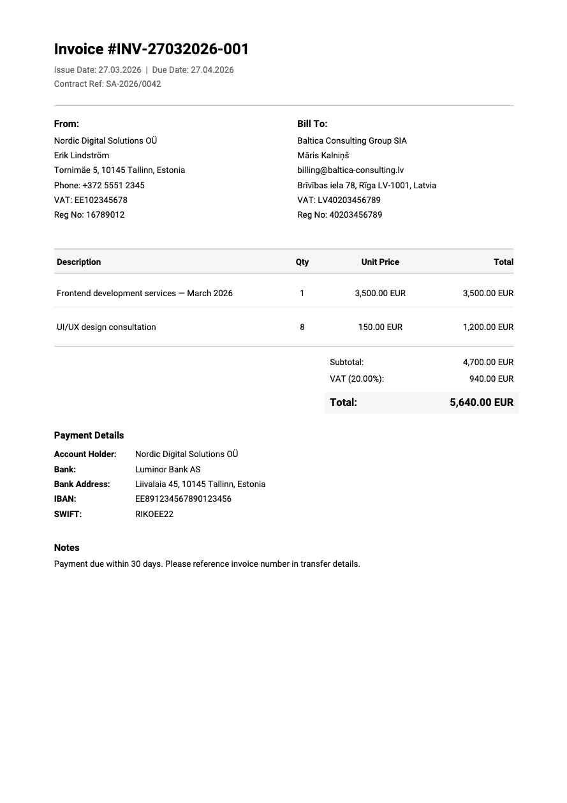

# Invoice Generator

A self-hosted invoicing tool for freelancers and small businesses. Create professional PDF invoices instantly — no registration required.



## Features

- **Guest mode** — create and download invoices without an account
- **PDF generation** — client-side A4 PDF with full Unicode support (Serbian Latin, Baltic characters)
- **Real-time calculations** — subtotal, VAT, and total update as you type
- **Form validation** — required fields, IBAN/SWIFT format checks, inline error messages
- **Responsive design** — works on desktop and mobile (320px+)
- **Confirmation dialog** — verify details before generating PDF

## Tech Stack

| Layer | Technology |
|-------|-----------|
| Framework | Vue.js 3 + TypeScript |
| State | Pinia |
| Styling | Tailwind CSS |
| PDF | jsPDF with embedded Roboto font |
| Build | Vite |
| Deploy | Docker + nginx |

## Quick Start

```bash
git clone <repo-url>
cd invoice-generator/frontend
npm install
npm run dev
```

Open http://localhost:5173

## Project Structure

```
invoice-generator/
├── frontend/          Vue.js application (Stage 1)
│   ├── src/
│   │   ├── components/   Invoice form sections, layout, confirm dialog
│   │   ├── composables/  Calculations, validation logic
│   │   ├── pages/        Landing page, guest invoice page
│   │   ├── services/     PDF generator
│   │   ├── stores/       Pinia invoice store
│   │   └── types/        TypeScript interfaces
│   ├── public/        Static assets (preview image/PDF)
│   ├── Dockerfile     Multi-stage build (node + nginx)
│   └── nginx.conf     SPA routing, gzip, cache headers
├── Documentation/     PRD and SRS
├── scripts/           Utility scripts (watermark generator)
└── docker-compose.yml Production deployment
```

## Staging Plan

| Stage | Scope | Status |
|-------|-------|--------|
| **Stage 1** | Guest invoice form + client-side PDF | **Done** |
| Stage 2 | Go backend + PostgreSQL + JWT auth | Planned |
| Stage 3 | Authorized dashboard, company/client management | Planned |
| Stage 4 | Flutter mobile app (iOS + Android) | Planned |

## Deployment

Build and run with Docker:

```bash
docker compose up -d --build
```

Serves on port 8080. Route through Cloudflare Tunnel for HTTPS.

## License

MIT
